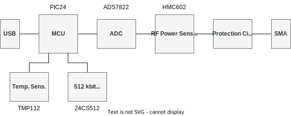
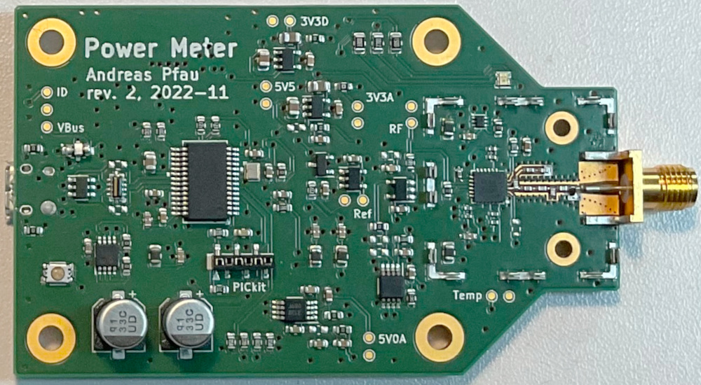
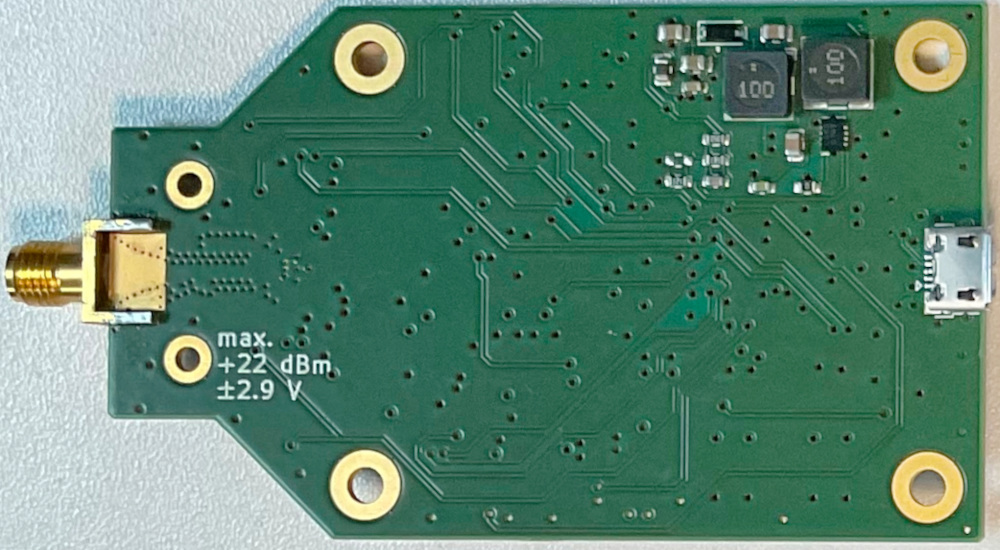

RF Powermeter
=============

A 10 MHz to 8 GHz RF power meter with USB connectivity.

## Design

## Photos

## Project Status

- Prototype is working
- Firmware is working, but does not apply compensation data yet

### Thoughts on Design

- The SMA connector is quite cheap, and will probably not last long (no stainless steel). Also, with the current design, the SMA tighening torque might break the solder connectio to the PCB (happened during testing).
- The HMC602 is EOL (see production notes below).

## Further Reading

- [RF Design](./doc/rfdesign.md)
- [Design Tools](./doc/designtools.md)
- [Production](./doc/production.md)
- [Serial Interface](./doc/serial.md)
- [Measurements](./doc/measurements.md)
- [Hardware Revisions](./doc/hwrev.md)
