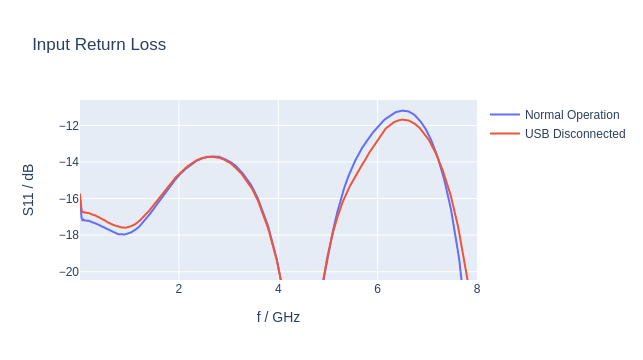
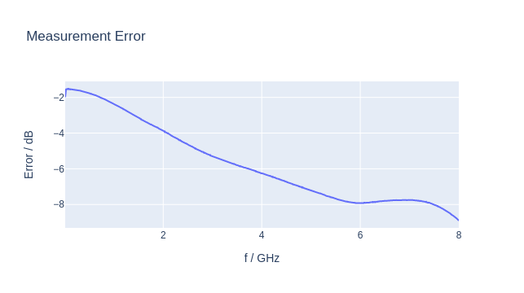
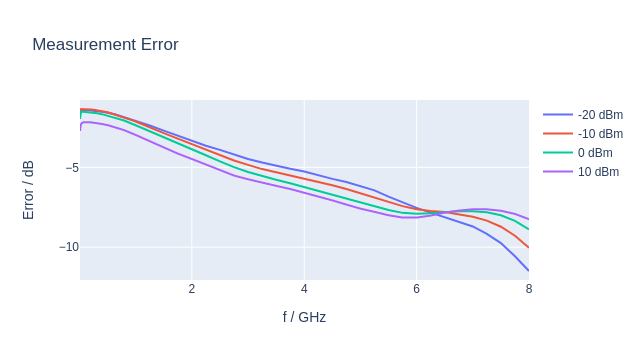
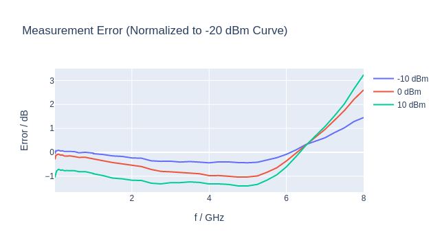
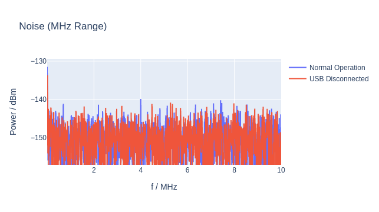
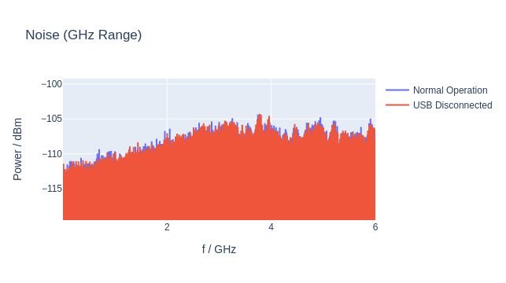

Measurements
============

## Summary

- Return Loss: -12 dB up to 6 GHz, which is good enough for a hobby project.
- Measurement error: no dips/resonances/etc, can easily be compensated with LUT.
- Linearity: around 1 dB error over a 20 dB range, which is more than expected, but accepable for a hobby project.
- Generated noise: no significant noise detected.

## Return Loss

Setup: Powermeter → Keysight PNA (calibrated with E-cal).

## Measurement Error

Setup: Keysight PSG → Power Divider → Keysight Powermeter (internal zero+cal) | Powermeter DUT.

### Linearity

## Generated Noise

Setup: Powermeter → Keysight UXA.

RBW was different for low- and high frequency range, which is why the measurements differ. The important part is that there is no significant output noise.
