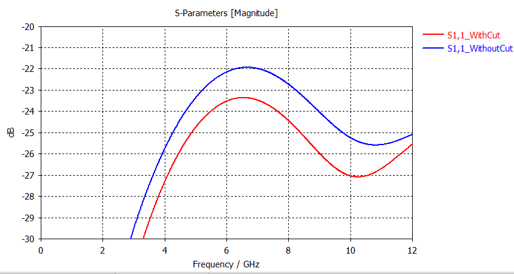

RF Design
=========

## PCB Stackup

The PCB was produced with the 4-layer stackup from [Aisler](https://aisler.net/) (as of 2022):

| Layer | Base Th. | Final Th. | Material                  | εr   | Df    |
|-------|----------|-----------|---------------------------|------|-------|
| Mask  |          |           | Elppemer AS 2467 SM-DG    | 3.70 |       |
| Top   | 18 µm    | 40 µm     | Copper                    |      |       |
|       | 69 µm    | 68.13 µm  | Prepreg 1080 / R-1551 (W) | 4.30 | 0.013 |
|       | 69 µm    | 68.13 µm  | Prepreg 1080 / R-1551 (W) | 4.30 | 0.013 |
| 2     | 35 µm    | 35 µm     | Copper                    |      |       |
|       | 1130 µm  | 1130 µm   | FR4 Core / R-1566 (W)     | 4.60 | 0.010 |
| 3     | 35 µm    | 35 µm     | Copper                    |      |       |
|       | 69 µm    | 68.13 µm  | Prepreg 1080 / R-1551 (W) | 4.30 | 0.013 |
|       | 69 µm    | 68.13 µm  | Prepreg 1080 / R-1551 (W) | 4.30 | 0.013 |
| Bot.  | 18 µm    | 40 µm     | Copper                    |      |       |
| Mask  |          |           | Elppemer AS 2467 SM-DG    | 3.70 |       |

The dielectric parameters are in the range from 2..6 GHz; for more details, [see here](https://industrial.panasonic.com/ww/products/pt/halogen-free/models/R-1566%25252FR-1551).

## RF Structures

The RF structures were simulated and optimized in [CST](https://www.3ds.com/products-services/simulia/products/cst-studio-suite/).

### Coplanar Waveguide

S-Parameters of a 20 mm trace:

| Frequency | Loss        |
|-----------|-------------|
| 1 GHz     | 0.049 dB/cm |
| 6 GHz     | 0.16 dB/cm  |
| 8 GHz     | 0.20 dB/cm  |

Geometry:

#### Sensitivity

Swept Parameters:

- Tline width: ±0.3 mm
- Prepreg thickness: ±20 µm
- Prepreg Dk: ±0.1 → almost no impact

Swept Parameters:

- Via diameter: 0.25 mm, 0.50 mm
- Via annular ring: 0.25 mm, 0.50mm
- Gap between annular rings is fixed at 0.025 mm.

### SMA Transition

S-Parameters:

Geometry:

### 0402 Resistors

S-Parameters:

Impact of GND-Cutout:

Geometry:

Top Cu:

Inner (GND) Cu:

## QFN Transition

S-Parameters:

Geometry:

